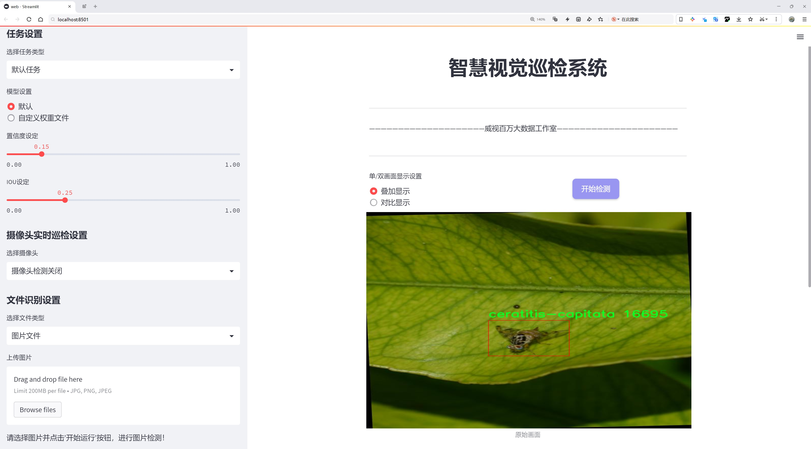
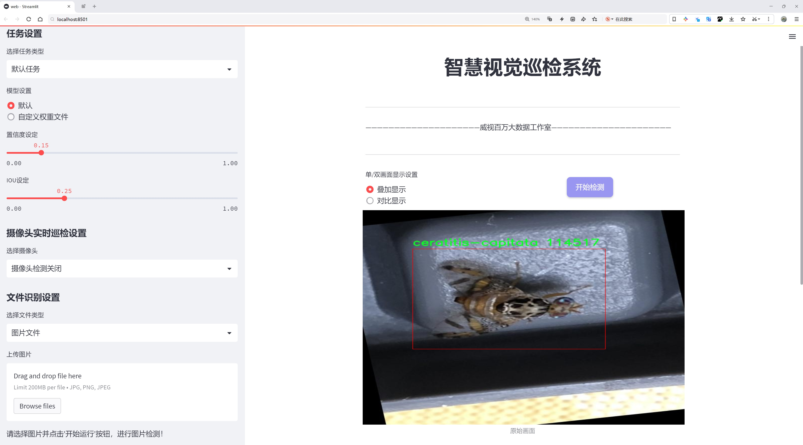
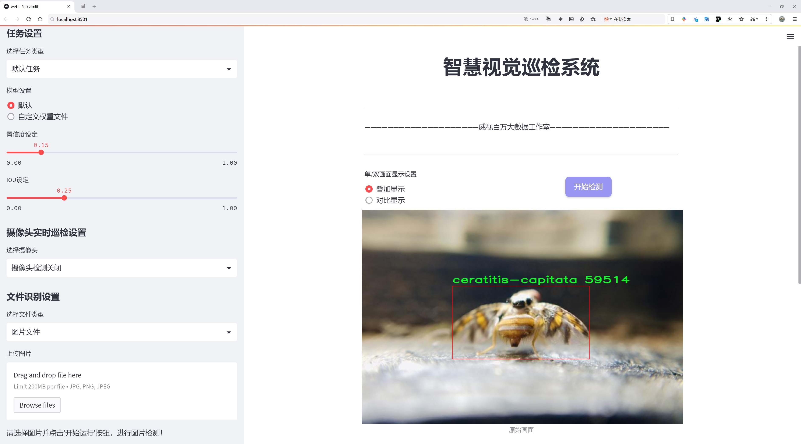
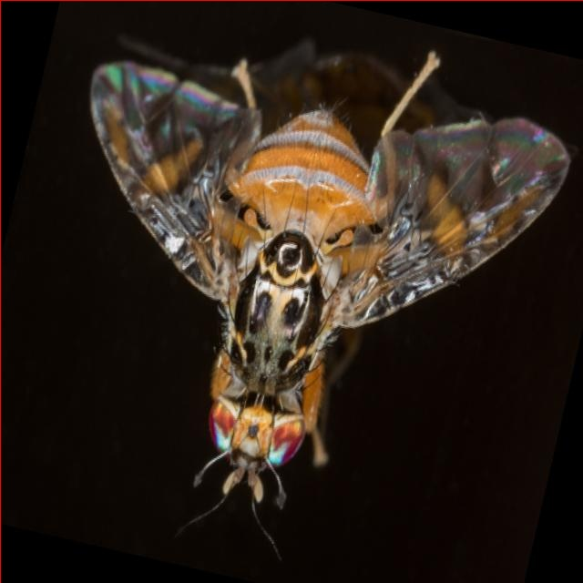
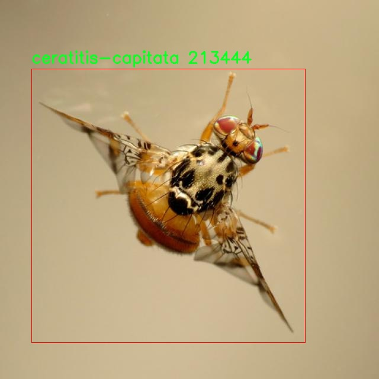
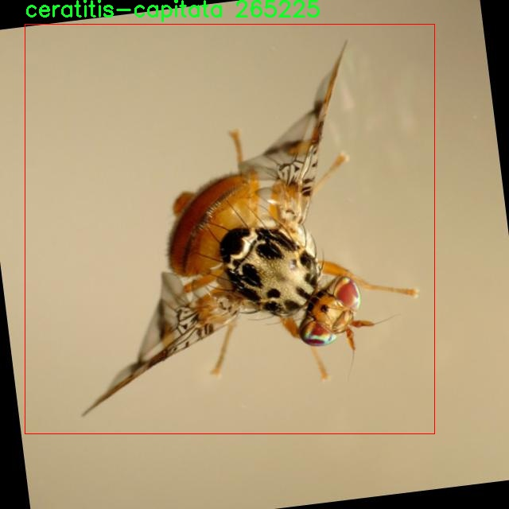
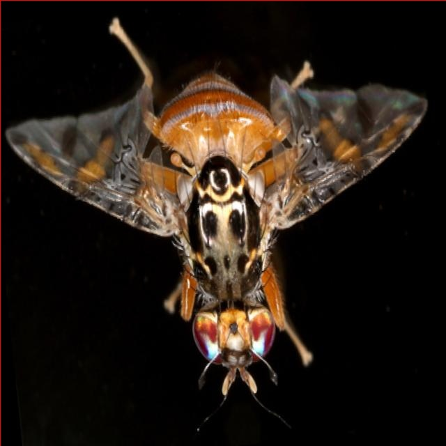
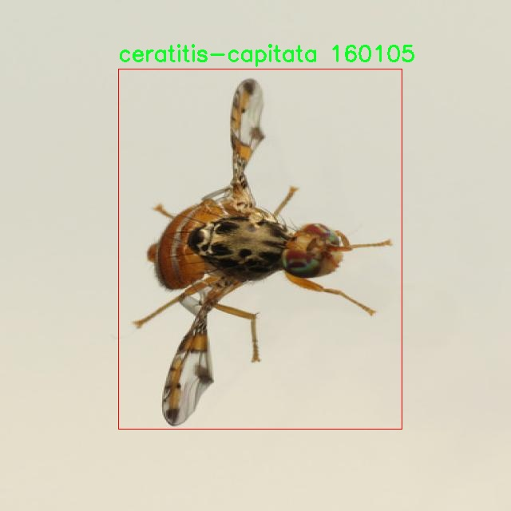

# 果蝇检测检测系统源码分享
 # [一条龙教学YOLOV8标注好的数据集一键训练_70+全套改进创新点发刊_Web前端展示]

### 1.研究背景与意义

项目参考[AAAI Association for the Advancement of Artificial Intelligence](https://gitee.com/qunmasj/projects)

项目来源[AACV Association for the Advancement of Computer Vision](https://kdocs.cn/l/cszuIiCKVNis)

研究背景与意义

随着全球农业生产的不断发展，果蝇（如地中海果蝇Ceratitis capitata）已成为影响果树种植和果品质量的重要害虫之一。果蝇不仅会导致果实的直接损害，还会对农作物的产量和品质造成严重影响，进而影响农民的经济收益和食品安全。因此，及时、准确地检测和监控果蝇的种群动态，对于制定有效的防治措施、提高农业生产效率具有重要的现实意义。

传统的果蝇检测方法多依赖人工观察和捕捉，这不仅耗时耗力，而且受限于观察者的主观判断，容易导致漏检和误判。随着计算机视觉和深度学习技术的快速发展，基于图像处理的自动化检测系统逐渐成为研究的热点。YOLO（You Only Look Once）系列模型因其高效的实时检测能力，已被广泛应用于各类物体检测任务中。YOLOv8作为该系列的最新版本，具有更高的检测精度和更快的处理速度，适合在复杂的农业环境中进行果蝇的实时监测。

本研究旨在基于改进的YOLOv8模型，构建一个高效的果蝇检测系统，以实现对Ceratitis capitata的自动识别和监测。为此，我们使用了Ceratitis-capitata-dataset数据集，该数据集包含2500张标注清晰的果蝇图像，专门针对Ceratitis capitata这一类别进行设计。数据集的丰富性和多样性为模型的训练提供了坚实的基础，使得模型能够在不同的环境和光照条件下保持良好的检测性能。

通过对YOLOv8模型的改进，我们将引入一些先进的技术，如特征金字塔网络（FPN）和注意力机制，以增强模型对小目标的检测能力和对背景干扰的鲁棒性。这些改进将有助于提高果蝇检测的准确性，降低误检率，从而为农业生产提供更为可靠的技术支持。

本研究的意义不仅在于提升果蝇检测的自动化水平，更在于为农业害虫监测提供一种新的解决方案。通过实现高效、准确的果蝇检测，我们能够为果农提供及时的预警信息，帮助他们制定科学的防治策略，降低农药使用量，保护生态环境。此外，该系统的成功应用还可以为其他农业害虫的检测提供借鉴，推动智能农业的发展。

综上所述，基于改进YOLOv8的果蝇检测系统的研究，不仅具有重要的理论价值，也具备广泛的应用前景。通过本研究，我们期望能够为果蝇的监测与防治提供新的思路和方法，为推动农业可持续发展贡献力量。

### 2.图片演示







##### 注意：由于此博客编辑较早，上面“2.图片演示”和“3.视频演示”展示的系统图片或者视频可能为老版本，新版本在老版本的基础上升级如下：（实际效果以升级的新版本为准）

  （1）适配了YOLOV8的“目标检测”模型和“实例分割”模型，通过加载相应的权重（.pt）文件即可自适应加载模型。

  （2）支持“图片识别”、“视频识别”、“摄像头实时识别”三种识别模式。

  （3）支持“图片识别”、“视频识别”、“摄像头实时识别”三种识别结果保存导出，解决手动导出（容易卡顿出现爆内存）存在的问题，识别完自动保存结果并导出到tempDir中。

  （4）支持Web前端系统中的标题、背景图等自定义修改，后面提供修改教程。

  另外本项目提供训练的数据集和训练教程,暂不提供权重文件（best.pt）,需要您按照教程进行训练后实现图片演示和Web前端界面演示的效果。

### 3.视频演示

[3.1 视频演示](https://www.bilibili.com/video/BV14ZsfevExj/)

### 4.数据集信息展示

##### 4.1 本项目数据集详细数据（类别数＆类别名）

nc: 1
names: ['ceratitis-capitata']


##### 4.2 本项目数据集信息介绍

数据集信息展示

在本研究中，我们使用了名为“Ceratitis-capitata-dataset”的数据集，以改进YOLOv8模型在果蝇检测任务中的表现。该数据集专注于地中海果蝇（Ceratitis capitata），这一物种在农业生态系统中具有重要的经济影响。通过精确检测和识别这一害虫，农民和农业科学家能够更有效地采取措施，减少其对作物的危害，从而提高农业生产的可持续性和经济效益。

“Ceratitis-capitata-dataset”数据集的设计旨在提供高质量的图像数据，以支持深度学习模型的训练和评估。该数据集包含丰富的图像样本，涵盖了不同环境和光照条件下的地中海果蝇。这些图像不仅展示了果蝇的不同姿态和角度，还考虑了背景的多样性，确保模型在实际应用中具备良好的泛化能力。数据集的多样性使得YOLOv8能够学习到果蝇在各种环境中的特征，从而提高检测的准确性和鲁棒性。

在类别方面，该数据集包含一个主要类别，即“ceratitis-capitata”。这一单一类别的设计简化了模型的训练过程，使得重点集中在果蝇的特征提取和识别上。通过专注于这一特定物种，研究人员能够深入分析和优化YOLOv8在果蝇检测中的表现，探索不同的超参数设置和网络结构调整对检测效果的影响。

为了确保数据集的有效性和可靠性，所有图像均经过严格的标注和审核。标注过程中，专业人员根据果蝇的特征对图像进行了精确的框选，确保每个样本都能为模型提供清晰的学习信号。这种高质量的标注不仅提升了数据集的价值，也为后续的模型训练和评估奠定了坚实的基础。

在数据集的使用过程中，我们还进行了数据增强，以进一步提升模型的性能。通过旋转、缩放、翻转和颜色变换等技术，生成了更多的训练样本。这种数据增强策略不仅增加了数据集的多样性，还有效地减少了模型对特定样本的过拟合风险，从而提高了检测的准确性和稳定性。

总之，“Ceratitis-capitata-dataset”是一个专注于地中海果蝇的高质量数据集，具有丰富的图像样本和严格的标注标准。通过该数据集的使用，我们期望能够显著提升YOLOv8在果蝇检测任务中的性能，为农业害虫管理提供更为精准和高效的解决方案。这一研究不仅具有重要的学术价值，也为实际农业生产提供了切实可行的技术支持，推动了智能农业的发展。











### 5.全套项目环境部署视频教程（零基础手把手教学）

[5.1 环境部署教程链接（零基础手把手教学）](https://www.ixigua.com/7404473917358506534?logTag=c807d0cbc21c0ef59de5)


[5.2 安装Python虚拟环境创建和依赖库安装视频教程链接（零基础手把手教学）](https://www.ixigua.com/7404474678003106304?logTag=1f1041108cd1f708b01a)

### 6.手把手YOLOV8训练视频教程（零基础小白有手就能学会）

[6.1 手把手YOLOV8训练视频教程（零基础小白有手就能学会）](https://www.ixigua.com/7404477157818401292?logTag=d31a2dfd1983c9668658)

### 7.70+种全套YOLOV8创新点代码加载调参视频教程（一键加载写好的改进模型的配置文件）

[7.1 70+种全套YOLOV8创新点代码加载调参视频教程（一键加载写好的改进模型的配置文件）](https://www.ixigua.com/7404478314661806627?logTag=29066f8288e3f4eea3a4)

### 8.70+种全套YOLOV8创新点原理讲解（非科班也可以轻松写刊发刊，V10版本正在科研待更新）

由于篇幅限制，每个创新点的具体原理讲解就不一一展开，具体见下列网址中的创新点对应子项目的技术原理博客网址【Blog】：


[8.1 70+种全套YOLOV8创新点原理讲解链接](https://gitee.com/qunmasj/good)

### 9.系统功能展示（检测对象为举例，实际内容以本项目数据集为准）

图9.1.系统支持检测结果表格显示

  图9.2.系统支持置信度和IOU阈值手动调节

  图9.3.系统支持自定义加载权重文件best.pt(需要你通过步骤5中训练获得)

  图9.4.系统支持摄像头实时识别

  图9.5.系统支持图片识别

  图9.6.系统支持视频识别

  图9.7.系统支持识别结果文件自动保存

  图9.8.系统支持Excel导出检测结果数据


### 10.原始YOLOV8算法原理

原始YOLOv8算法原理

YOLOv8作为YOLO系列的最新版本，代表了目标检测领域的一次重要进步。它不仅继承了前几代模型的优点，还引入了一系列创新的设计和改进，使得模型在准确性和速度上达到了新的高度。YOLOv8的核心结构可以分为三个主要部分：Backbone、Neck和Head，这些部分共同协作，以实现高效的特征提取和目标检测。

在Backbone部分，YOLOv8采用了CSPDarknet（Cross Stage Partial Darknet）作为特征提取的基础架构。CSPDarknet通过将网络分为两个部分并引入多个残差块，增强了特征提取的能力。与前代模型YOLOv5相比，YOLOv8使用了C2f模块替代了C3模块。C2f模块的设计使得输入特征图被分成两个分支，每个分支通过卷积层进行降维处理。这种结构不仅提高了特征图的维度，还通过堆叠多个分支来增强梯度流的信息，使得模型在学习过程中能够捕捉到更丰富的特征。

在特征提取的过程中，YOLOv8还引入了快速空间金字塔池化（SPPF）结构，这一设计能够有效提取不同尺度的特征，进而减少模型的参数量和计算量，同时提升特征提取的效率。通过这种方式，YOLOv8能够在处理复杂场景时，依然保持高效的特征提取能力。

进入Neck部分，YOLOv8采用了特征金字塔网络（FPN）和路径聚合网络（PAN）的组合结构。这一结构通过多个卷积层和池化层，对特征图进行处理和压缩，确保了信息的有效传递。通过这样的设计，YOLOv8能够更好地整合来自不同层次的特征信息，从而提升目标检测的准确性。

在Head部分，YOLOv8采用了无锚框（Anchor-Free）的检测方式，这一创新使得模型能够直接预测目标的中心点和宽高比例，避免了传统Anchor框的复杂性。这种方法不仅减少了Anchor框的数量，还显著提高了检测速度和准确度。YOLOv8还引入了任务对齐学习（TAL）机制，以区分正负样本，优化分类和定位的损失函数，从而实现更高效的模型训练。

值得注意的是，YOLOv8在训练过程中对数据增强策略进行了优化，特别是在最后的训练阶段停止使用Mosaic数据增强，以避免对数据真实分布的破坏。这一策略的调整，使得模型在训练时能够更好地学习到真实的特征，提高了模型的泛化能力。

在性能方面，YOLOv8在COCO数据集上的表现令人瞩目。通过对比不同尺寸的模型，YOLOv8在保持参数量不变的情况下，取得了更高的mAP（mean Average Precision）值。这表明，YOLOv8在准确性上相较于其他同类模型有了显著提升。此外，YOLOv8在推理速度上也表现出色，能够在实时检测的场景中，快速响应并提供准确的检测结果。

总的来说，YOLOv8通过对Backbone、Neck和Head部分的创新设计，结合无锚框的检测方式和任务对齐学习机制，形成了一种高效的目标检测模型。它不仅在准确性和速度上超越了前代模型，还为目标检测领域带来了新的思路和方法。随着YOLOv8的广泛应用，尤其是在自动化和智能化领域，其潜力和价值将会得到进一步的挖掘和体现。


### 11.项目核心源码讲解（再也不用担心看不懂代码逻辑）

#### 11.1 code\ultralytics\models\fastsam\utils.py

以下是经过简化和注释的核心代码，保留了主要功能，并对每个部分进行了详细的中文注释：

```python
import torch

def adjust_bboxes_to_image_border(boxes, image_shape, threshold=20):
    """
    调整边界框，使其在距离图像边界一定阈值内时贴合边界。

    参数:
        boxes (torch.Tensor): 边界框的坐标，形状为(n, 4)
        image_shape (tuple): 图像的高度和宽度，形状为(高度, 宽度)
        threshold (int): 距离边界的像素阈值

    返回:
        adjusted_boxes (torch.Tensor): 调整后的边界框
    """
    h, w = image_shape  # 获取图像的高度和宽度

    # 调整边界框的坐标
    boxes[boxes[:, 0] < threshold, 0] = 0  # 将左上角x坐标调整为0
    boxes[boxes[:, 1] < threshold, 1] = 0  # 将左上角y坐标调整为0
    boxes[boxes[:, 2] > w - threshold, 2] = w  # 将右下角x坐标调整为图像宽度
    boxes[boxes[:, 3] > h - threshold, 3] = h  # 将右下角y坐标调整为图像高度
    return boxes  # 返回调整后的边界框

def bbox_iou(box1, boxes, iou_thres=0.9, image_shape=(640, 640), raw_output=False):
    """
    计算一个边界框与其他边界框的交并比（IoU）。

    参数:
        box1 (torch.Tensor): 单个边界框的坐标，形状为(4, )
        boxes (torch.Tensor): 其他边界框的坐标，形状为(n, 4)
        iou_thres (float): IoU阈值
        image_shape (tuple): 图像的高度和宽度，形状为(高度, 宽度)
        raw_output (bool): 如果为True，返回原始IoU值而不是索引

    返回:
        high_iou_indices (torch.Tensor): IoU大于阈值的边界框索引
    """
    boxes = adjust_bboxes_to_image_border(boxes, image_shape)  # 调整边界框到图像边界

    # 计算交集的坐标
    x1 = torch.max(box1[0], boxes[:, 0])  # 交集左上角x坐标
    y1 = torch.max(box1[1], boxes[:, 1])  # 交集左上角y坐标
    x2 = torch.min(box1[2], boxes[:, 2])  # 交集右下角x坐标
    y2 = torch.min(box1[3], boxes[:, 3])  # 交集右下角y坐标

    # 计算交集面积
    intersection = (x2 - x1).clamp(0) * (y2 - y1).clamp(0)  # 交集面积，确保不为负

    # 计算两个边界框的面积
    box1_area = (box1[2] - box1[0]) * (box1[3] - box1[1])  # box1的面积
    box2_area = (boxes[:, 2] - boxes[:, 0]) * (boxes[:, 3] - boxes[:, 1])  # 其他边界框的面积

    # 计算并集面积
    union = box1_area + box2_area - intersection  # 并集面积

    # 计算IoU
    iou = intersection / union  # 交并比，形状为(n, )
    if raw_output:
        return 0 if iou.numel() == 0 else iou  # 如果需要原始IoU值，直接返回

    # 返回IoU大于阈值的边界框索引
    return torch.nonzero(iou > iou_thres).flatten()
```

### 代码说明：
1. **`adjust_bboxes_to_image_border` 函数**：该函数用于调整边界框的位置，使其在接近图像边界时能够贴合边界，避免边界框超出图像范围。
2. **`bbox_iou` 函数**：该函数计算一个边界框与一组其他边界框之间的交并比（IoU），并返回与阈值比较后符合条件的边界框索引。通过调用 `adjust_bboxes_to_image_border` 函数，确保所有边界框都在图像范围内。

这个文件包含了两个主要的函数，分别用于调整边界框和计算边界框之间的交并比（IoU）。首先，`adjust_bboxes_to_image_border`函数的作用是将边界框调整到图像的边界上，确保它们不会超出图像的范围。如果边界框的某个边距图像边界的距离小于指定的阈值（默认为20个像素），那么这个边界框的对应边界会被调整到图像的边界上。例如，如果左边界的x坐标小于阈值，则将其设置为0；如果右边界的x坐标大于图像宽度减去阈值，则将其设置为图像的宽度。这个过程确保了边界框在图像内的有效性。

接下来，`bbox_iou`函数用于计算一个边界框与一组其他边界框之间的交并比。首先，它调用`adjust_bboxes_to_image_border`函数来调整输入的边界框，确保它们在图像边界内。然后，函数计算交集的坐标，通过比较两个边界框的坐标来获得交集区域的左上角和右下角坐标。接着，计算交集的面积以及每个边界框的面积，进而计算出并集的面积。最后，通过交集面积除以并集面积来得到IoU值。

该函数还提供了一个参数`raw_output`，如果设置为True，则返回原始的IoU值；如果为False，则返回与IoU大于指定阈值的边界框的索引。这样，用户可以根据需要选择是否需要原始的IoU值或是符合条件的边界框索引。

总体来说，这个文件的功能是为了处理图像中的边界框，确保它们在图像内，并计算它们之间的重叠程度，以便在目标检测等任务中进行进一步的处理。

#### 11.2 ui.py

以下是经过简化并注释的核心代码部分：

```python
import sys
import subprocess

def run_script(script_path):
    """
    使用当前 Python 环境运行指定的脚本。

    Args:
        script_path (str): 要运行的脚本路径

    Returns:
        None
    """
    # 获取当前 Python 解释器的路径
    python_path = sys.executable

    # 构建运行命令，使用 streamlit 运行指定的脚本
    command = f'"{python_path}" -m streamlit run "{script_path}"'

    # 执行命令并等待其完成
    result = subprocess.run(command, shell=True)
    
    # 检查命令执行结果，如果返回码不为0，表示出错
    if result.returncode != 0:
        print("脚本运行出错。")

# 主程序入口
if __name__ == "__main__":
    # 指定要运行的脚本路径
    script_path = "web.py"  # 假设脚本在当前目录下

    # 调用函数运行脚本
    run_script(script_path)
```

### 代码注释说明：
1. **导入模块**：
   - `sys`：用于获取当前 Python 解释器的路径。
   - `subprocess`：用于执行外部命令。

2. **`run_script` 函数**：
   - 接收一个参数 `script_path`，表示要运行的脚本路径。
   - 使用 `sys.executable` 获取当前 Python 解释器的路径。
   - 构建一个命令字符串，使用 `streamlit` 模块运行指定的脚本。
   - 使用 `subprocess.run` 执行构建的命令，并等待其完成。
   - 检查命令的返回码，如果不为0，打印错误信息。

3. **主程序入口**：
   - 在脚本被直接运行时，指定要运行的脚本路径（此处假设为 "web.py"）。
   - 调用 `run_script` 函数来执行指定的脚本。

这个程序文件的主要功能是通过当前的 Python 环境来运行一个指定的脚本，具体来说是一个名为 `web.py` 的脚本。文件首先导入了必要的模块，包括 `sys`、`os` 和 `subprocess`，这些模块分别用于获取系统信息、处理文件路径和执行外部命令。

在 `run_script` 函数中，首先定义了一个参数 `script_path`，用于接收要运行的脚本的路径。函数内部首先获取当前 Python 解释器的路径，这样可以确保在正确的环境中运行脚本。接着，构建了一个命令字符串，该命令使用 `streamlit` 来运行指定的脚本。`streamlit` 是一个用于构建数据应用的库，这里通过 `-m` 参数来指定模块运行。

随后，使用 `subprocess.run` 方法执行构建好的命令。该方法会在一个新的 shell 中运行命令，并返回一个结果对象。通过检查 `result.returncode`，可以判断脚本是否成功运行。如果返回码不为零，表示脚本运行出错，程序会输出一条错误信息。

在文件的最后部分，使用 `if __name__ == "__main__":` 语句来确保当文件作为主程序运行时，才会执行后面的代码。这里指定了要运行的脚本路径 `web.py`，并调用 `run_script` 函数来执行该脚本。

整体来看，这个程序的结构简单明了，主要是为了方便地在指定的 Python 环境中运行一个 Streamlit 应用脚本。

#### 11.3 code\ultralytics\models\__init__.py

以下是代码中最核心的部分，并附上详细的中文注释：

```python
# 导入必要的模块
from .rtdetr import RTDETR  # 从当前包中导入 RTDETR 类
from .sam import SAM        # 从当前包中导入 SAM 类
from .yolo import YOLO      # 从当前包中导入 YOLO 类

# 定义可以被外部导入的模块列表
__all__ = "YOLO", "RTDETR", "SAM"  # 允许更简单的导入方式
```

### 详细注释：

1. **模块导入**：
   - `from .rtdetr import RTDETR`：从当前包（即当前目录）中的 `rtdetr` 模块导入 `RTDETR` 类。这意味着 `RTDETR` 是一个用于目标检测的模型，可能与 YOLO 类似。
   - `from .sam import SAM`：从当前包中的 `sam` 模块导入 `SAM` 类。`SAM` 可能是另一个与图像处理或目标检测相关的模型。
   - `from .yolo import YOLO`：从当前包中的 `yolo` 模块导入 `YOLO` 类。`YOLO` 是一种流行的实时目标检测模型。

2. **`__all__` 的定义**：
   - `__all__ = "YOLO", "RTDETR", "SAM"`：这个特殊变量 `__all__` 用于定义当使用 `from package import *` 语句时，哪些模块或类是可以被导入的。这里指定了 `YOLO`、`RTDETR` 和 `SAM`，意味着这三个类是当前包的主要接口，用户可以直接使用它们而不需要知道包的内部结构。

这个程序文件是一个Python模块的初始化文件，通常用于定义模块的公共接口。在这个文件中，首先通过注释说明了该模块属于Ultralytics YOLO项目，并且使用的是AGPL-3.0许可证。

接下来，文件导入了三个类或函数：`RTDETR`、`SAM`和`YOLO`，这些类或函数分别来自于同一目录下的其他模块（`rtdetr.py`、`sam.py`和`yolo.py`）。通过这种方式，当前模块可以将这些功能集中在一起，方便用户使用。

最后，`__all__`变量被定义为一个元组，包含了三个字符串："YOLO"、"RTDETR"和"SAM"。这个变量的作用是控制当使用`from module import *`语句时，哪些名称会被导入。通过定义`__all__`，模块的作者可以明确哪些类或函数是公共的，哪些是内部使用的，从而提高代码的可读性和可维护性。

总的来说，这个文件的主要功能是组织和简化模块的导入，使得用户可以更方便地使用Ultralytics YOLO项目中的相关功能。

#### 11.4 code\web.py

以下是代码中最核心的部分，并附上详细的中文注释：

```python
import cv2
import numpy as np
from PIL import ImageFont, ImageDraw, Image

def draw_with_chinese(image, text, position, font_size=20, color=(255, 0, 0)):
    """
    在OpenCV图像上绘制中文文字
    """
    # 将图像从 OpenCV 格式（BGR）转换为 PIL 格式（RGB）
    image_pil = Image.fromarray(cv2.cvtColor(image, cv2.COLOR_BGR2RGB))
    draw = ImageDraw.Draw(image_pil)
    # 使用指定的字体
    font = ImageFont.truetype("simsun.ttc", font_size, encoding="unic")
    draw.text(position, text, font=font, fill=color)
    # 将图像从 PIL 格式（RGB）转换回 OpenCV 格式（BGR）
    return cv2.cvtColor(np.array(image_pil), cv2.COLOR_RGB2BGR)

def adjust_parameter(image_size, base_size=1000):
    """
    计算自适应参数，基于图片的最大尺寸
    """
    max_size = max(image_size)  # 获取图像的最大尺寸
    return max_size / base_size  # 返回自适应参数

def draw_detections(image, info, alpha=0.2):
    """
    在图像上绘制检测结果，包括边界框和标签
    """
    name, bbox, conf, cls_id, mask = info['class_name'], info['bbox'], info['score'], info['class_id'], info['mask']
    adjust_param = adjust_parameter(image.shape[:2])  # 获取自适应参数
    if mask is None:
        # 当 mask 为 None，计算 bbox 的矩形框面积
        x1, y1, x2, y2 = bbox
        aim_frame_area = (x2 - x1) * (y2 - y1)

        # 绘制矩形框
        cv2.rectangle(image, (x1, y1), (x2, y2), color=(0, 0, 255), thickness=int(3*adjust_param))

        # 绘制标签和面积
        label_area = f"{name} {int(aim_frame_area)}"
        image = draw_with_chinese(image, label_area, (x1, y1 - int(30 * adjust_param)), font_size=int(35*adjust_param))

    else:
        # 当 mask 不为 None，计算点集围成的多边形面积
        mask_points = np.concatenate(mask)  # 假设 mask 是一个列表，内含一个 numpy 数组
        aim_frame_area = calculate_polygon_area(mask_points)
        try:
            # 绘制mask的轮廓
            cv2.drawContours(image, [mask_points.astype(np.int32)], -1, (0, 0, 255), thickness=int(3*adjust_param))

            # 绘制标签和面积
            label_area = f"{name}  {int(aim_frame_area)}"
            x, y = np.min(mask_points, axis=0).astype(int)
            image = draw_with_chinese(image, label_area, (x, y - int(30 * adjust_param)), font_size=int(35*adjust_param))
        except:
            pass

    return image, aim_frame_area

def calculate_polygon_area(points):
    """
    计算多边形的面积，输入应为一个 Nx2 的numpy数组，表示多边形的顶点坐标
    """
    if len(points) < 3:  # 多边形至少需要3个顶点
        return 0
    return cv2.contourArea(points)  # 使用OpenCV计算多边形面积

class Detection_UI:
    """
    检测系统类，负责设置界面和处理检测逻辑
    """
    def __init__(self):
        """
        初始化检测系统的参数
        """
        self.cls_name = Label_list  # 类别标签列表
        self.colors = [[random.randint(0, 255) for _ in range(3)] for _ in range(len(self.cls_name))]  # 随机颜色

        # 初始化检测相关的配置参数
        self.model_type = None
        self.conf_threshold = 0.15  # 默认置信度阈值
        self.iou_threshold = 0.5  # 默认IOU阈值

        # 初始化相机和文件相关的变量
        self.selected_camera = None
        self.file_type = None
        self.uploaded_file = None
        self.uploaded_video = None

        # 初始化检测结果相关的变量
        self.detection_result = None
        self.detection_location = None
        self.detection_confidence = None
        self.detection_time = None

    def process_camera_or_file(self):
        """
        处理摄像头或文件输入，根据用户选择的输入源（摄像头、图片文件或视频文件），处理并显示检测结果
        """
        if self.selected_camera != "摄像头检测关闭":
            # 使用 OpenCV 捕获摄像头画面
            cap = cv2.VideoCapture(self.selected_camera)

            while cap.isOpened():
                ret, frame = cap.read()
                if ret:
                    image, detInfo, _ = self.frame_process(frame, 'camera')  # 处理当前帧
                    # 显示处理后的图像
                    cv2.imshow("Detection", image)
                    if cv2.waitKey(1) & 0xFF == ord('q'):
                        break
                else:
                    break
            cap.release()
            cv2.destroyAllWindows()
        else:
            # 处理上传的文件
            if self.uploaded_file is not None:
                source_img = self.uploaded_file.read()
                file_bytes = np.asarray(bytearray(source_img), dtype=np.uint8)
                image_ini = cv2.imdecode(file_bytes, 1)
                image, detInfo, _ = self.frame_process(image_ini, self.uploaded_file.name)

    def frame_process(self, image, file_name):
        """
        处理并预测单个图像帧的内容
        """
        pre_img = self.model.preprocess(image)  # 对图像进行预处理
        params = {'conf': self.conf_threshold, 'iou': self.iou_threshold}
        self.model.set_param(params)

        pred = self.model.predict(pre_img)  # 使用模型进行预测
        detInfo = []  # 初始化检测信息

        if pred is not None and len(pred):
            det_info = self.model.postprocess(pred)  # 后处理预测结果
            for info in det_info:
                image, aim_frame_area = draw_detections(image, info)  # 绘制检测结果
                detInfo.append([info['class_name'], info['bbox'], aim_frame_area])  # 保存检测信息

        return image, detInfo  # 返回处理后的图像和检测信息

# 实例化并运行应用
if __name__ == "__main__":
    app = Detection_UI()
    app.process_camera_or_file()  # 运行摄像头或文件处理
```

### 代码说明：
1. **draw_with_chinese**: 在图像上绘制中文文字的函数，使用PIL库处理字体。
2. **adjust_parameter**: 根据图像尺寸计算自适应参数，用于调整绘制的框和文字大小。
3. **draw_detections**: 在图像上绘制检测结果，包括边界框和标签。
4. **calculate_polygon_area**: 计算多边形的面积，确保多边形至少有三个顶点。
5. **Detection_UI**: 检测系统的主类，负责初始化参数、处理摄像头或文件输入、以及图像处理和预测。
6. **process_camera_or_file**: 根据用户选择的输入源处理图像或视频流。
7. **frame_process**: 处理单个图像帧，进行模型预测并返回处理后的图像和检测信息。

这个程序文件 `code\web.py` 是一个基于 Streamlit 的图像和视频检测应用，主要用于实时监控和检测。它结合了计算机视觉技术，使用预训练的模型对图像或视频流中的对象进行识别和标记。以下是对代码的详细说明。

首先，程序导入了一系列必要的库，包括用于图像处理的 OpenCV 和 NumPy，Streamlit 用于构建网页应用，以及一些自定义的模块和工具函数。这些库提供了图像处理、用户界面构建和数据记录等功能。

程序定义了多个函数和一个类 `Detection_UI`。其中，`draw_with_chinese` 函数用于在图像上绘制中文文本，`adjust_parameter` 用于根据图像大小调整绘制参数，`draw_detections` 则负责在图像上绘制检测框和标签。`calculate_polygon_area` 函数计算多边形的面积，`format_time` 用于格式化时间，`save_chinese_image` 则用于保存带有中文路径的图像文件。

`Detection_UI` 类是整个应用的核心，负责初始化和管理检测系统的各个部分。在构造函数中，类初始化了一些属性，包括模型类型、置信度阈值、摄像头选择、上传文件等。同时，它还设置了页面的布局和样式，并加载了可用的摄像头列表和模型。

在 `setup_page` 和 `setup_sidebar` 方法中，程序设置了页面的标题和侧边栏的选项，包括模型选择、摄像头配置和文件上传等。用户可以选择不同的模型和文件类型（图片或视频），并通过滑动条调整置信度和 IOU 阈值。

`process_camera_or_file` 方法是处理用户输入的核心逻辑。如果用户选择了摄像头，它会使用 OpenCV 捕获视频流并进行实时检测；如果用户上传了图片或视频文件，则会读取文件并进行处理。检测结果会实时更新到页面上，并通过进度条显示处理进度。

`frame_process` 方法用于处理单个图像帧，进行模型预测并返回处理后的图像和检测信息。该方法调用模型的预处理和后处理函数，并绘制检测框和标签。

此外，程序还提供了导出结果的功能，用户可以将检测结果保存为 CSV 文件。整个应用的界面友好，支持实时监控和结果记录，适合用于智能监控和安全检测等场景。

最后，程序的入口部分实例化 `Detection_UI` 类并运行应用，确保在运行时能够正确展示用户界面并处理用户输入。整体来看，这个程序是一个功能完整的图像和视频检测系统，结合了多种技术实现了实时检测和结果展示。

#### 11.5 code\ultralytics\models\yolo\obb\predict.py

以下是代码中最核心的部分，并附上详细的中文注释：

```python
import torch
from ultralytics.engine.results import Results
from ultralytics.models.yolo.detect.predict import DetectionPredictor
from ultralytics.utils import ops

class OBBPredictor(DetectionPredictor):
    """
    OBBPredictor类扩展了DetectionPredictor类，用于基于定向边界框（OBB）模型进行预测。
    """

    def __init__(self, cfg=DEFAULT_CFG, overrides=None, _callbacks=None):
        """初始化OBBPredictor，支持模型和数据配置的可选覆盖。"""
        super().__init__(cfg, overrides, _callbacks)  # 调用父类的初始化方法
        self.args.task = "obb"  # 设置任务类型为“obb”

    def postprocess(self, preds, img, orig_imgs):
        """对预测结果进行后处理，并返回Results对象的列表。"""
        # 应用非极大值抑制（NMS）来过滤重叠的边界框
        preds = ops.non_max_suppression(
            preds,
            self.args.conf,  # 置信度阈值
            self.args.iou,  # IOU阈值
            agnostic=self.args.agnostic_nms,  # 是否进行类别无关的NMS
            max_det=self.args.max_det,  # 最大检测数量
            nc=len(self.model.names),  # 类别数量
            classes=self.args.classes,  # 需要检测的类别
            rotated=True,  # 是否处理旋转的边界框
        )

        # 如果输入图像不是列表，则将其转换为numpy数组
        if not isinstance(orig_imgs, list):
            orig_imgs = ops.convert_torch2numpy_batch(orig_imgs)

        results = []  # 初始化结果列表
        # 遍历每个预测结果、原始图像和图像路径
        for pred, orig_img, img_path in zip(preds, orig_imgs, self.batch[0]):
            # 将预测的边界框坐标缩放到原始图像的尺寸
            pred[:, :4] = ops.scale_boxes(img.shape[2:], pred[:, :4], orig_img.shape, xywh=True)
            # 组合边界框信息，包括坐标、置信度和类别
            obb = torch.cat([pred[:, :4], pred[:, -1:], pred[:, 4:6]], dim=-1)
            # 创建Results对象并添加到结果列表中
            results.append(Results(orig_img, path=img_path, names=self.model.names, obb=obb))
        return results  # 返回处理后的结果列表
```

### 代码说明：
1. **导入必要的库**：导入PyTorch和Ultralytics库中的相关模块。
2. **OBBPredictor类**：该类继承自`DetectionPredictor`，用于处理定向边界框的预测。
3. **初始化方法**：在初始化时，调用父类的构造函数，并设置任务类型为“obb”。
4. **后处理方法**：
   - 使用非极大值抑制（NMS）来过滤重叠的边界框，确保输出的边界框是最优的。
   - 将输入的图像转换为numpy数组（如果不是列表的话）。
   - 遍历每个预测结果，缩放边界框坐标，并将结果存储在`Results`对象中，最终返回这些结果。

这个程序文件是Ultralytics YOLO（You Only Look Once）模型的一个扩展，用于基于定向边界框（Oriented Bounding Box，OBB）进行预测。文件中定义了一个名为`OBBPredictor`的类，它继承自`DetectionPredictor`类，主要用于处理图像中的物体检测任务。

在类的构造函数`__init__`中，首先调用了父类的构造函数，并传入了配置参数和其他可选的覆盖参数。这里，`self.args.task`被设置为"obb"，表明该预测器的任务是处理定向边界框。

`postprocess`方法用于对模型的预测结果进行后处理。它接收三个参数：`preds`（模型的预测结果）、`img`（输入图像）和`orig_imgs`（原始图像）。在这个方法中，首先调用`ops.non_max_suppression`函数对预测结果进行非极大值抑制，以去除冗余的检测框。该函数使用了一些参数，如置信度阈值、IOU阈值、是否使用类无关的NMS等。

接下来，代码检查`orig_imgs`是否为列表，如果不是，则将其转换为NumPy数组。然后，程序遍历每个预测结果和对应的原始图像，将预测框的坐标从当前图像的尺寸缩放到原始图像的尺寸。预测框的格式为`xywh`（中心点坐标和宽高），同时还将其他信息（如置信度和类别）合并到一个张量中。

最后，程序将处理后的结果封装成`Results`对象，并返回一个结果列表。每个`Results`对象包含了原始图像、图像路径、模型的类别名称以及处理后的OBB信息。

这个文件的整体结构和功能设计旨在为YOLO模型提供一个灵活的接口，以便在定向边界框检测任务中进行高效的预测和后处理。

#### 11.6 train.py

以下是代码中最核心的部分，并附上详细的中文注释：

```python
class DetectionTrainer(BaseTrainer):
    """
    DetectionTrainer类，继承自BaseTrainer类，用于基于检测模型的训练。
    """

    def build_dataset(self, img_path, mode="train", batch=None):
        """
        构建YOLO数据集。

        参数:
            img_path (str): 包含图像的文件夹路径。
            mode (str): 模式，可以是'train'或'val'，用户可以为每种模式自定义不同的数据增强。
            batch (int, optional): 批次大小，仅在'rect'模式下使用。默认为None。
        """
        gs = max(int(de_parallel(self.model).stride.max() if self.model else 0), 32)  # 获取模型的最大步幅
        return build_yolo_dataset(self.args, img_path, batch, self.data, mode=mode, rect=mode == "val", stride=gs)

    def get_dataloader(self, dataset_path, batch_size=16, rank=0, mode="train"):
        """构造并返回数据加载器。"""
        assert mode in ["train", "val"]  # 确保模式有效
        with torch_distributed_zero_first(rank):  # 在分布式环境中，确保数据集只初始化一次
            dataset = self.build_dataset(dataset_path, mode, batch_size)  # 构建数据集
        shuffle = mode == "train"  # 训练模式下打乱数据
        if getattr(dataset, "rect", False) and shuffle:
            LOGGER.warning("WARNING ⚠️ 'rect=True' is incompatible with DataLoader shuffle, setting shuffle=False")
            shuffle = False  # 如果使用'rect'模式，禁用打乱
        workers = self.args.workers if mode == "train" else self.args.workers * 2  # 设置工作线程数
        return build_dataloader(dataset, batch_size, workers, shuffle, rank)  # 返回数据加载器

    def preprocess_batch(self, batch):
        """对一批图像进行预处理，包括缩放和转换为浮点数。"""
        batch["img"] = batch["img"].to(self.device, non_blocking=True).float() / 255  # 将图像转移到设备并归一化
        if self.args.multi_scale:  # 如果启用多尺度
            imgs = batch["img"]
            sz = (
                random.randrange(self.args.imgsz * 0.5, self.args.imgsz * 1.5 + self.stride)
                // self.stride
                * self.stride
            )  # 随机选择图像大小
            sf = sz / max(imgs.shape[2:])  # 计算缩放因子
            if sf != 1:
                ns = [
                    math.ceil(x * sf / self.stride) * self.stride for x in imgs.shape[2:]
                ]  # 计算新的形状
                imgs = nn.functional.interpolate(imgs, size=ns, mode="bilinear", align_corners=False)  # 进行插值缩放
            batch["img"] = imgs  # 更新批次图像
        return batch

    def set_model_attributes(self):
        """设置模型的属性，包括类别数量和名称。"""
        self.model.nc = self.data["nc"]  # 将类别数量附加到模型
        self.model.names = self.data["names"]  # 将类别名称附加到模型
        self.model.args = self.args  # 将超参数附加到模型

    def get_model(self, cfg=None, weights=None, verbose=True):
        """返回YOLO检测模型。"""
        model = DetectionModel(cfg, nc=self.data["nc"], verbose=verbose and RANK == -1)  # 创建检测模型
        if weights:
            model.load(weights)  # 加载权重
        return model

    def get_validator(self):
        """返回YOLO模型验证器。"""
        self.loss_names = "box_loss", "cls_loss", "dfl_loss"  # 定义损失名称
        return yolo.detect.DetectionValidator(
            self.test_loader, save_dir=self.save_dir, args=copy(self.args), _callbacks=self.callbacks
        )

    def label_loss_items(self, loss_items=None, prefix="train"):
        """
        返回带标签的训练损失项字典。

        对于分割和检测是必要的，但对于分类不需要。
        """
        keys = [f"{prefix}/{x}" for x in self.loss_names]  # 创建损失项的键
        if loss_items is not None:
            loss_items = [round(float(x), 5) for x in loss_items]  # 将张量转换为5位小数的浮点数
            return dict(zip(keys, loss_items))  # 返回损失字典
        else:
            return keys

    def progress_string(self):
        """返回格式化的训练进度字符串，包括轮次、GPU内存、损失、实例和大小。"""
        return ("\n" + "%11s" * (4 + len(self.loss_names))) % (
            "Epoch",
            "GPU_mem",
            *self.loss_names,
            "Instances",
            "Size",
        )

    def plot_training_samples(self, batch, ni):
        """绘制带有注释的训练样本。"""
        plot_images(
            images=batch["img"],
            batch_idx=batch["batch_idx"],
            cls=batch["cls"].squeeze(-1),
            bboxes=batch["bboxes"],
            paths=batch["im_file"],
            fname=self.save_dir / f"train_batch{ni}.jpg",
            on_plot=self.on_plot,
        )

    def plot_metrics(self):
        """从CSV文件中绘制指标。"""
        plot_results(file=self.csv, on_plot=self.on_plot)  # 保存结果图像

    def plot_training_labels(self):
        """创建YOLO模型的标记训练图。"""
        boxes = np.concatenate([lb["bboxes"] for lb in self.train_loader.dataset.labels], 0)  # 合并所有边界框
        cls = np.concatenate([lb["cls"] for lb in self.train_loader.dataset.labels], 0)  # 合并所有类别
        plot_labels(boxes, cls.squeeze(), names=self.data["names"], save_dir=self.save_dir, on_plot=self.on_plot)  # 绘制标签
```

以上代码实现了YOLO模型的训练过程，包括数据集的构建、数据加载、图像预处理、模型属性设置、模型获取、损失计算和训练样本的可视化等功能。

这个程序文件 `train.py` 是一个用于训练 YOLO（You Only Look Once）目标检测模型的脚本，继承自 `BaseTrainer` 类。它包含了一系列方法，用于构建数据集、获取数据加载器、预处理图像、设置模型属性、获取模型、进行验证、记录损失、输出训练进度、绘制训练样本和指标等。

首先，`DetectionTrainer` 类定义了一个用于目标检测的训练器。用户可以通过传入模型路径、数据集配置和训练轮数等参数来实例化该类，并调用 `train()` 方法开始训练。

在 `build_dataset` 方法中，程序根据传入的图像路径和模式（训练或验证）构建 YOLO 数据集。它会根据模型的步幅（stride）来确定数据集的大小。

`get_dataloader` 方法用于构建并返回数据加载器。它会根据模式选择是否打乱数据，并设置工作线程的数量。特别地，在分布式训练中，它会确保数据集只初始化一次。

`preprocess_batch` 方法对输入的图像批次进行预处理，包括将图像缩放到适当的大小并转换为浮点数格式。它还支持多尺度训练，随机选择图像的大小以增强模型的鲁棒性。

`set_model_attributes` 方法用于设置模型的属性，包括类别数量和类别名称等，以确保模型能够正确处理数据集中的目标。

`get_model` 方法返回一个 YOLO 检测模型，并可以选择加载预训练权重。

`get_validator` 方法返回一个用于验证模型性能的验证器，并记录损失名称。

`label_loss_items` 方法用于返回带有标签的训练损失项字典，方便后续的损失分析。

`progress_string` 方法返回一个格式化的字符串，显示训练进度，包括当前轮次、GPU 内存使用情况、损失值、实例数量和图像大小等信息。

`plot_training_samples` 方法用于绘制训练样本及其标注，帮助可视化训练过程中的数据。

最后，`plot_metrics` 和 `plot_training_labels` 方法用于绘制训练过程中记录的指标和标签，便于分析模型的训练效果和性能。

整体而言，这个文件实现了 YOLO 模型训练的核心功能，提供了数据处理、模型管理和训练监控等一系列必要的工具，适合于目标检测任务的开发和研究。

### 12.系统整体结构（节选）

### 整体功能和构架概括

该项目主要是一个基于 YOLO（You Only Look Once）模型的目标检测框架，结合了多种计算机视觉技术和工具，提供了训练、预测和可视化等功能。项目的结构清晰，分为多个模块，每个模块负责特定的功能。整体上，项目可以分为以下几个部分：

1. **模型定义与训练**：包含 YOLO 模型的定义、训练过程和损失计算等功能。
2. **数据处理**：提供数据加载、预处理和增强等功能，以便于模型训练和评估。
3. **预测与后处理**：实现了模型的预测功能，并对预测结果进行后处理，如非极大值抑制和结果格式化。
4. **用户界面**：通过 Streamlit 提供了一个友好的用户界面，方便用户上传图像或视频并进行实时检测。
5. **工具函数**：包含一些辅助功能，如绘制图像、计算指标等，帮助用户分析模型性能。

### 文件功能整理表

| 文件路径                                                                 | 功能描述                                                         |
|------------------------------------------------------------------------|----------------------------------------------------------------|
| `code\ultralytics\models\fastsam\utils.py`                            | 提供边界框调整和交并比计算的工具函数。                                      |
| `code\ui.py`                                                           | 运行指定的 Streamlit 应用脚本（`web.py`），用于启动用户界面。                  |
| `code\ultralytics\models\__init__.py`                                 | 初始化模块，导入并集中管理 YOLO、RTDETR 和 SAM 模型的接口。                   |
| `code\web.py`                                                         | 基于 Streamlit 的图像和视频检测应用，支持实时监控和结果展示。                  |
| `code\ultralytics\models\yolo\obb\predict.py`                        | 定义用于定向边界框（OBB）预测的类，处理模型的预测和后处理。                     |
| `train.py`                                                            | 实现 YOLO 模型的训练过程，包括数据集构建、模型管理和训练监控等功能。            |
| `70+种YOLOv8算法改进源码大全和调试加载训练教程（非必要）\ultralytics\utils\metrics.py` | 提供计算模型性能指标的工具函数，如精度、召回率等。                              |
| `code\ultralytics\data\loaders.py`                                    | 定义数据加载器，负责从数据集中加载和预处理图像数据。                             |
| `code\ultralytics\solutions\ai_gym.py`                                | 提供与 AI Gym 相关的功能，可能用于强化学习或模拟环境。                           |
| `70+种YOLOv8算法改进源码大全和调试加载训练教程（非必要）\ultralytics\nn\modules\head.py` | 定义 YOLO 模型的头部结构，处理输出层的特征提取和预测。                          |
| `70+种YOLOv8算法改进源码大全和调试加载训练教程（非必要）\ultralytics\models\yolo\segment\train.py` | 实现 YOLO 模型的分割任务训练功能。                                         |
| `code\ultralytics\models\fastsam\prompt.py`                           | 提供与 FastSAM 模型相关的功能，可能用于提示或引导检测过程。                       |
| `70+种YOLOv8算法改进源码大全和调试加载训练教程（非必要）\ultralytics\models\yolo\detect\train.py` | 实现 YOLO 模型的检测任务训练功能。                                         |

以上表格整理了项目中各个文件的功能，帮助理解整个项目的结构和各个模块之间的关系。

注意：由于此博客编辑较早，上面“11.项目核心源码讲解（再也不用担心看不懂代码逻辑）”中部分代码可能会优化升级，仅供参考学习，完整“训练源码”、“Web前端界面”和“70+种创新点源码”以“13.完整训练+Web前端界面+70+种创新点源码、数据集获取”的内容为准。

### 13.完整训练+Web前端界面+70+种创新点源码、数据集获取


# [下载链接：https://mbd.pub/o/bread/Zpuam5xy](https://mbd.pub/o/bread/Zpuam5xy)